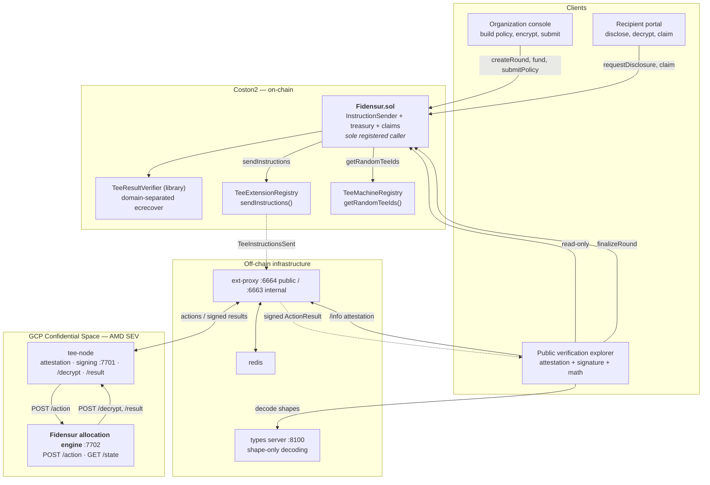
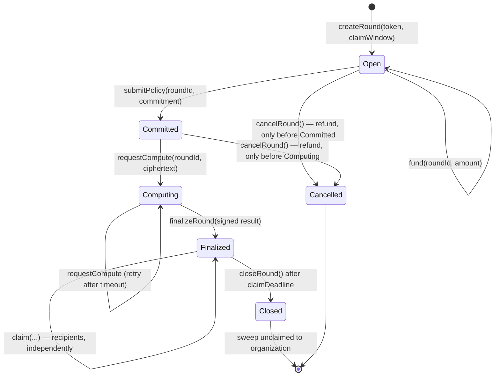
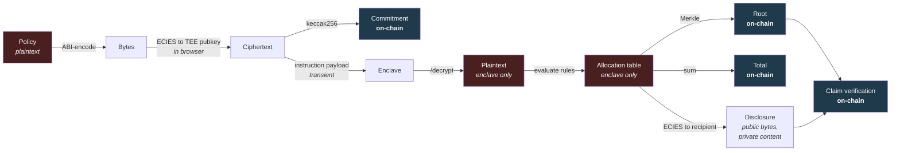

# Fidensur — Architecture

**Allocate funds privately. Prove the computation publicly.**

**Status:** Phase 2 — architecture. Normative for implementation.
**Depends on:** [`fcc-research.md`](./fcc-research.md) — every FCC mechanism referenced here is
documented there, with sources.
**Target network:** Coston2 (chain ID 114).

---

## 1. The Problem

An organization wants to pay 200 contributors different amounts. Today it has two options:

- **Pay on-chain transparently.** Every contributor sees every other contributor's compensation.
  For payroll, grants, and bounties this is usually unacceptable — it is a disclosure the
  organization never agreed to make.
- **Pay off-chain.** Nobody can verify the organization actually distributed what it said it did,
  that the allocation rules were applied consistently, or that the totals add up.

The two properties look mutually exclusive. They are not, if the *computation* can be attested
without the *inputs* being revealed.

**Fidensur's claim:** individual allocations stay confidential; the fact that a specific, published
allocation program ran inside an attested TEE over a committed input, and produced a specific
aggregate, is publicly verifiable by anyone.

### 1.1 What is private, what is public

Being precise about this is the whole product.

| Data | On-chain | Visible to public | Visible to organization | Visible to recipient |
| --- | --- | --- | --- | --- |
| Recipient list (addresses) | ✗ | ✗ | ✓ | own entry |
| Individual amounts | ✗ | ✗ | ✓ | own entry |
| Allocation rules (weights, caps, bands) | ✗ | ✗ | ✓ | ✗ |
| Policy commitment (`keccak256`) | ✓ | ✓ | ✓ | ✓ |
| Merkle root of allocations | ✓ | ✓ | ✓ | ✓ |
| **Total** allocated | ✓ | ✓ | ✓ | ✓ |
| **Number** of recipients | ✓ | ✓ | ✓ | ✓ |
| TEE signature over the above | ✓ | ✓ | ✓ | ✓ |
| Attested code hash of the engine | ✓ | ✓ | ✓ | ✓ |
| A claimed amount, after claiming | ✓ | ✓ | ✓ | ✓ |

The last row is the honest caveat and is treated as a first-class limitation
([§9.4](#94-accepted-residual-risks)): **claiming is a self-disclosure**. An ERC-20 transfer of
`N` tokens to address `A` reveals that `A` received `N`. Fidensur keeps every *unclaimed* allocation
private and never reveals the distribution as a whole, but it cannot make a settled payment
invisible. Anyone claiming that property of an EVM-settled system is wrong.

---

## 2. Why Flare Confidential Compute

Fidensur is not a generic dApp with an optional privacy feature bolted on. Each of its core
mechanisms maps directly to a capability only FCC provides:

| Fidensur requirement | FCC capability used |
| --- | --- |
| Allocation rules and amounts must never be public | Enclave-resident computation on ECIES-encrypted input, decrypted via `tee-node`'s `/decrypt` |
| Anyone must be able to confirm the computation really ran | Domain-separated TEE signature, `ecrecover`-verified on-chain ([research §8.3](./fcc-research.md#83-on-chain-verification-of-a-tee-result)) |
| Anyone must be able to confirm *which program* ran | On-chain code-hash allowlist + reproducible Go build ([research §8.1–8.2](./fcc-research.md#8-attestation-and-verification)) |
| Only authorized parties may trigger an allocation | Registry binds the extension to exactly one InstructionSender ([research §4.1](./fcc-research.md#41-iteeextensionregistry)) |
| A recipient must learn their own amount and nobody else's | TEE encrypts a per-recipient disclosure to that recipient's public key |
| Results must not be replayable across rounds or chains | `actionId` + `chainId` + `status` are inside the signed payload |

Strip FCC out and there is no product left. A ZK circuit could prove correct summation but not that
a *specific published binary* processed a *confidential policy* — and it could not hold the
allocation rules themselves secret while doing so.

---

## 3. System Architecture



### 3.1 Component responsibilities

| Component | Owned by | Responsibility |
| --- | --- | --- |
| **`Fidensur.sol`** | us | Treasury custody, round lifecycle, authorization, instruction dispatch, TEE-signature verification, Merkle claims |
| **`TeeResultVerifier.sol`** | us | Pure library: reconstruct `ActionResult.Hash()`, apply domain separation, `ecrecover` |
| **Allocation engine (Go)** | us | Decrypt policy, evaluate allocation rules, build Merkle tree, emit signed aggregate, encrypt per-recipient disclosures |
| **Types server (Go)** | us | Render instruction/result *shapes* for the explorer without revealing plaintext |
| `TeeExtensionRegistry` / `TeeMachineRegistry` | Flare | Registration, routing, fee collection |
| `tee-node`, `ext-proxy`, `redis` | Flare | Attestation, signing, chain watching, result delivery |
| **Frontend (Next.js)** | us | Org console, recipient portal, public explorer |

We own exactly the two boxes the FCC architecture designates as developer-owned — the
InstructionSender and the action handler — plus presentation. Nothing in the FCC architecture is
redesigned.

---

## 4. Smart Contract Architecture

### 4.1 Contract layout

```
contracts/
├── Fidensur.sol                     ★ the registered InstructionSender + treasury + claims
├── libraries/
│   ├── TeeResultVerifier.sol        domain-separated TEE result verification
│   └── AllocationMerkle.sol         leaf encoding + proof verification
└── interfaces/
    ├── ITeeExtensionRegistry.sol    (verbatim from scaffold)
    ├── ITeeMachineRegistry.sol      (verbatim from scaffold)
    └── IFidensur.sol                external surface for integrators
```

**Why one main contract.** The registry binds an extension to exactly **one** InstructionSender
address and rejects `sendInstructions` from anything else. Splitting the treasury from the sender
would force a delegation hop whose only purpose is to satisfy the registry, adding an authorization
surface without adding safety. `fce-weather-insurance` makes the same call. Verification and Merkle
logic live in libraries so they are unit-testable in isolation.

### 4.2 Operation identifiers

Per [research §5](./fcc-research.md#5-the-optype--opcommand-routing-model), these must match across
Solidity, Go config, and the Go router. All are ≤ 31 bytes.

| Solidity constant | Value | Purpose |
| --- | --- | --- |
| `OP_TYPE_ALLOC` | `bytes32("ALLOC")` | Operation group |
| `OP_COMMAND_COMPUTE` | `bytes32("COMPUTE")` | Decrypt policy, compute allocations, return signed aggregate |
| `OP_COMMAND_DISCLOSE` | `bytes32("DISCLOSE")` | Return one recipient's allocation, encrypted to them |
| `OP_COMMAND_ATTEST` | `bytes32("ATTEST")` | Re-emit a round's signed integrity record |

`ATTEST` exists because a signed result can be lost before it reaches the chain — the relay
transaction can fail, or the tunnel can drop. Without it, a lost signature would mean recomputing,
and recomputation is not free. `ATTEST` re-emits the record for an already-computed round from
enclave state.

### 4.3 Round state machine



Transitions are one-way except the `Computing` self-loop, which exists because FCC instruction
delivery is not guaranteed: a TEE can be unreachable, the proxy can lag, the result can be lost.
Retry is gated on a timeout so it cannot be used to spam instructions.

`Open → Committed` is separate from `Committed → Computing` deliberately: the commitment must be
recorded **before** the ciphertext is dispatched, so the organization cannot swap the policy after
seeing which TEE will process it.

### 4.4 Storage design

```solidity
enum RoundStatus { None, Open, Committed, Computing, Finalized, Closed, Cancelled }

struct Round {
    // --- slot-packed header ---
    address organization;      // 20 bytes ┐
    RoundStatus status;        //  1 byte  ├─ 1 slot
    uint32  recipientCount;    //  4 bytes │  set at finalize
    uint64  claimDeadline;     //  8 bytes ┘  wait: see note below

    address token;             // 20 bytes ┐  address(0) = native C2FLR
    uint64  computeRequestedAt;//  8 bytes ├─ 1 slot
    bool    swept;             //  1 byte  ┘

    uint256 funded;            // total deposited
    uint256 totalAllocated;    // set at finalize; invariant: <= funded
    uint256 totalClaimed;

    bytes32 policyCommitment;  // keccak256 of the encrypted policy blob
    bytes32 merkleRoot;        // set at finalize
    bytes32 computeInstructionId;
    bytes32 engineVersion;     // bytes32 of the engine version string that computed it
}

mapping(uint256 => Round) private _rounds;
mapping(uint256 => mapping(uint256 => uint256)) private _claimedBitmap; // roundId => word => bits
uint256 public nextRoundId;
```

> **Packing note.** `address(20) + enum(1) + uint32(4) + uint64(8) = 33 bytes` overflows one slot.
> The implementation drops `claimDeadline` into the second group so the header fits in 32 bytes.
> Recording the arithmetic here rather than the aspiration, because a comment claiming a packing
> that does not hold is worse than no comment.

**Claim tracking uses a bitmap**, not `mapping(address => bool)`. The standard airdrop pattern:
each recipient gets an `index` assigned by the engine, and claiming sets bit `index % 256` of word
`index / 256`. One `SSTORE` per 256 claims after the first in each word, versus one per claim.

**What is deliberately *not* stored:** recipient addresses, individual amounts, allocation rules, the
policy ciphertext. The ciphertext is passed as an instruction payload and never persisted —
[research §10](./fcc-research.md#10-known-limitations) item 2 is explicit that storing encrypted
secrets on-chain is unsafe for production, because on-chain data is permanent and encryption weakens
over time. The commitment is the durable record; the ciphertext is transient.

### 4.5 The verification library

Copied exactly from the pattern in [research §8.3](./fcc-research.md#83-on-chain-verification-of-a-tee-result).
This is the single most correctness-critical piece of Solidity in the project.

```solidity
library TeeResultVerifier {
    bytes32 internal constant TEE_ACTION_RESULT_PREFIX = bytes32("TEE_ACTION_RESULT");

    function verify(
        bytes calldata resultData,
        bytes32 actionId,
        string calldata submissionTag,
        uint8 status,
        bytes calldata signature,
        address expectedTee
    ) internal view returns (bool) {
        if (status != 1) return false;                       // only successes are relayable

        bytes32 resultHash = keccak256(abi.encodePacked(
            keccak256(resultData), actionId, keccak256(bytes(submissionTag)), status));

        bytes32 payloadHash = keccak256(abi.encode(
            TEE_ACTION_RESULT_PREFIX, block.chainid, resultHash));

        return _recover(_ethSigned(payloadHash), signature) == expectedTee;
    }
}
```

Four bindings this provides, each defeating a concrete attack:

| Binding | Attack prevented |
| --- | --- |
| `chainId` | Replaying a Coston2 signature on another chain |
| `actionId` | Replaying a valid result against a *different* round's instruction |
| `status` | Relaying a TEE *failure* as if it were a success |
| signer == `teeAddress` | Forging results from an unregistered machine |

**The trap** ([research §8.3](./fcc-research.md#83-on-chain-verification-of-a-tee-result)):
verifying against the bare `resultHash`, without the `abi.encode(TEE_ACTION_RESULT, chainId, ·)`
wrapper, fails against every real TEE signature. It must match `go-flare-common`'s
`signing.TEEActionResult`.

### 4.6 `finalizeRound` — the trust hinge

```solidity
function finalizeRound(
    bytes calldata resultData,
    bytes32 actionId,
    string calldata submissionTag,
    uint8 status,
    bytes calldata signature
) external {
    require(TeeResultVerifier.verify(
        resultData, actionId, submissionTag, status, signature, teeAddress), "bad TEE result");

    (address contractAddr, uint256 roundId, bytes32 policyCommitment,
     bytes32 merkleRoot, uint256 totalAllocated, uint32 recipientCount, bytes32 engineVersion)
        = abi.decode(resultData,
            (address, uint256, bytes32, bytes32, uint256, uint32, bytes32));

    require(contractAddr == address(this),              "result not for this contract");
    Round storage r = _rounds[roundId];
    require(r.status == RoundStatus.Computing,          "round not computing");
    require(actionId == r.computeInstructionId,         "result not for this round's instruction");
    require(policyCommitment == r.policyCommitment,     "policy commitment mismatch");
    require(merkleRoot != bytes32(0),                   "empty merkle root");
    require(totalAllocated <= r.funded,                 "over-allocated");
    require(recipientCount > 0,                         "no recipients");
    // ... write root, totals, engineVersion; status = Finalized; set claimDeadline
}
```

Note what is checked and why:

- **`contractAddr == address(this)`** — the TEE stamps the target contract into the result, so a
  result produced for a different Fidensur deployment cannot be relayed here.
- **`actionId == r.computeInstructionId`** — binds this result to *this round's* instruction, not
  merely to some instruction from this contract. Without it, a result from round 5 could finalize
  round 6.
- **`policyCommitment == r.policyCommitment`** — proves the TEE processed the ciphertext the
  organization committed to on-chain, not a substituted one.
- **`totalAllocated <= r.funded`** — the solvency invariant. The contract can never promise more
  than it holds, regardless of what the TEE says.

`finalizeRound` is **permissionless**. Anyone holding the signed result may submit it, which means
the organization cannot suppress an unfavourable outcome by withholding the transaction.

### 4.7 Claims

```
leaf = keccak256(bytes.concat(keccak256(abi.encode(roundId, index, recipient, amount))))
```

The **double hash** is the standard defence against second-preimage attacks on Merkle trees: it makes
a leaf hash structurally distinguishable from an internal node hash, so a 64-byte internal node can
never be reinterpreted as a leaf. Internal nodes use sorted-pair hashing (OpenZeppelin
`MerkleProof` convention), so proofs carry no direction bits.

`roundId` inside the leaf prevents a proof from one round being replayed against another that
happens to share a root.

```solidity
function claim(uint256 roundId, uint256 index, uint256 amount, bytes32[] calldata proof) external {
    Round storage r = _rounds[roundId];
    require(r.status == RoundStatus.Finalized,   "round not finalized");
    require(block.timestamp <= r.claimDeadline,  "claim window closed");
    require(!_isClaimed(roundId, index),         "already claimed");
    require(AllocationMerkle.verify(
        r.merkleRoot, roundId, index, msg.sender, amount, proof), "bad proof");

    _setClaimed(roundId, index);
    r.totalClaimed += amount;
    _payout(r.token, msg.sender, amount);        // CEI: state written before transfer
}
```

`msg.sender` is bound into the leaf, so a proof is useless to anyone but its owner — a leaked proof
does not become a stealable payment.

---

## 5. FCC Extension Architecture

### 5.1 Module layout

```
extension/
├── cmd/
│   ├── docker/main.go          single-process entrypoint (tee-node + extension)
│   └── types-server/main.go    shape decoder sidecar
├── internal/
│   ├── config/config.go        ★ OPType/OPCommand constants, version, ports
│   └── engine/
│       ├── engine.go           ★ routing + handlers
│       ├── allocate.go         ★ allocation rule evaluation
│       ├── merkle.go           deterministic Merkle construction
│       ├── crypto.go           ECIES decrypt (via node) / encrypt (local)
│       └── utils.go            action handler, buildResult, async completion
└── pkg/
    └── types/
        ├── types.go            ★ request/response/state structs + ABI layouts
        └── register.go         ★ types-server decoder registrations
```

★ = files a developer customizes, per [research §7.5](./fcc-research.md#75-files-a-developer-modifies).
`New()`, `actionHandler()`, and `buildResult()` are reproduced from the scaffold unchanged.

**Go, not Python or TypeScript.** Only Go gives bit-for-bit *cross-machine* reproducible builds
([research §8.2](./fcc-research.md#82-reproducible-builds)). Fidensur's entire public-verifiability
claim is "rebuild the published source, get the whitelisted code hash." A guarantee that holds only
on the machine that happened to build it is not a guarantee.

### 5.2 Handler dispatch

| OPType | OPCommand | Sync/async | Input encoding | Output encoding |
| --- | --- | --- | --- | --- |
| `ALLOC` | `COMPUTE` | **async** | ECIES ciphertext | ABI (consumed on-chain) |
| `ALLOC` | `DISCLOSE` | sync | ABI | ABI wrapping ECIES ciphertext |
| `ALLOC` | `ATTEST` | sync | ABI | ABI (consumed on-chain) |

**`COMPUTE` must be async.** `tee-node`'s `POST /action` budget is ~2 seconds
([research §3.1](./fcc-research.md#31-timing-constraint--the-2-second-post-budget)); decrypting a
policy, evaluating rules over hundreds of recipients, and building a Merkle tree will exceed it.
The handler returns `status: 2` / `log: "pending"` immediately, continues on a goroutine, and posts
the finished `ActionResult` to `http://localhost:$SIGN_PORT/result`, exactly as
`fce-weather-insurance` does.

**`COMPUTE` and `ATTEST` outputs are ABI-encoded, not JSON**, because `finalizeRound` `abi.decode`s
them. `ActionResult.Data` is hashed and signed byte-for-byte
([research §6.4](./fcc-research.md#64-actionresult--response-body)), so the encoding must be exactly
what the contract expects.

### 5.3 Allocation policy

The confidential input, ABI-encoded then ECIES-encrypted to the TEE public key:

```go
type Policy struct {
    ContractAddr common.Address  // must equal the target Fidensur deployment
    RoundID      *big.Int
    Organization common.Address  // must equal the round's organization on-chain
    Mode         uint8           // 0 = ExplicitAmounts, 1 = WeightedShare, 2 = TieredBands
    TotalBudget  *big.Int
    MinAlloc     *big.Int        // floor; entries below are dropped, not silently rounded
    MaxAlloc     *big.Int        // cap; excess is redistributed per Mode
    Entries      []PolicyEntry
    Salt         [32]byte        // blinds the commitment against dictionary attack
}

type PolicyEntry struct {
    Recipient common.Address
    Weight    *big.Int  // Mode 1: relative share. Mode 2: band index.
    Amount    *big.Int  // Mode 0: exact amount.
}
```

Three modes, because the allocation logic is exactly what organizations most want to keep private:

| Mode | Semantics |
| --- | --- |
| `ExplicitAmounts` | Amounts given directly. Simplest; still fully confidential. |
| `WeightedShare` | `amountᵢ = floor(TotalBudget × weightᵢ / Σweight)`, then caps applied and the remainder redistributed among uncapped entries. |
| `TieredBands` | Entries carry a band index; each band has a fixed per-recipient amount. Models salary bands without revealing the band table. |

**Determinism is a hard requirement.** The same policy must produce a byte-identical Merkle root on
any machine, or verification is meaningless. Therefore:

- All arithmetic is integer (`math/big`); **no floating point anywhere**.
- Division truncates toward zero, explicitly and consistently.
- Entries are sorted by recipient address before indexing, so input ordering cannot change the root.
- The dust remainder from truncation goes to the **lowest-indexed** eligible recipient — an
  arbitrary rule, but a *fixed* one, and stated so it can be checked.
- Map iteration is never used to build output. Go randomizes map order by design.

**Validation before execution** — `originalMessage` is untrusted input
([research §7.4](./fcc-research.md#74-the-4-step-handler-pattern)):

1. `ContractAddr` matches the configured deployment.
2. `Organization` matches the round's on-chain organization.
3. `Σ allocations ≤ TotalBudget` — checked after computation, not assumed.
4. No duplicate recipients; no zero addresses; no zero amounts in the final table.
5. `len(Entries)` within `[1, MaxRecipients]`, bounding enclave memory and gas.
6. Every field bounds-checked before use.

### 5.4 The `COMPUTE` flow

```mermaid
sequenceDiagram
    participant Org as Organization
    participant C as Fidensur.sol
    participant R as TeeExtensionRegistry
    participant P as ext-proxy
    participant N as tee-node
    participant E as Allocation engine
    participant Any as Anyone

    Org->>Org: build policy, ABI-encode, ECIES-encrypt to TEE pubkey
    Org->>C: submitPolicy(roundId, keccak256(ciphertext))
    Note over C: commitment recorded BEFORE dispatch
    Org->>C: requestCompute(roundId, ciphertext) {value: fee}
    C->>C: assert msg.sender == organization, status == Committed
    C->>C: assert keccak256(ciphertext) == policyCommitment
    C->>R: sendInstructions(teeIds, {ALLOC, COMPUTE, ciphertext})
    R-->>C: instructionId
    C->>C: store computeInstructionId; status = Computing

    R-->>P: TeeInstructionsSent
    P->>N: deliver action
    N->>E: POST /action
    E-->>N: 200 {status: 2, log: "pending"}

    Note over E: async goroutine
    E->>N: POST /decrypt {encryptedMessage: base64}
    N-->>E: {decryptedMessage: base64}
    E->>E: ABI-decode, validate, evaluate rules
    E->>E: sort by address, assign indices, build Merkle tree
    E->>E: retain table in enclave memory keyed by policyCommitment
    E->>N: POST /result (ABI-encoded aggregate, status 1)
    N->>N: sign: EIP191(keccak256(abi.encode(<br/>TEE_ACTION_RESULT, chainId, resultHash)))
    N->>P: signed ActionResult

    Any->>P: poll for result
    P-->>Any: signed ActionResult
    Any->>C: finalizeRound(resultData, actionId, tag, status, signature)
    C->>C: ecrecover == teeAddress; bind actionId, commitment; totalAllocated <= funded
    C->>C: status = Finalized; store merkleRoot
```

The public result contains only:

```
abi.encode(
    address contractAddr,
    uint256 roundId,
    bytes32 policyCommitment,
    bytes32 merkleRoot,
    uint256 totalAllocated,
    uint32  recipientCount,
    bytes32 engineVersion
)
```

No address, no amount, no rule. Everything needed for public verification; nothing that discloses.

### 5.5 The `DISCLOSE` flow

How a recipient learns their own allocation without anyone else learning it.

```mermaid
sequenceDiagram
    participant Rec as Recipient
    participant C as Fidensur.sol
    participant E as Allocation engine
    participant P as ext-proxy

    Rec->>Rec: derive secp256k1 disclosure pubkey
    Rec->>C: requestDisclosure(roundId, pubkey) {value: fee}
    C->>C: stamp msg.sender into payload — recipient cannot be spoofed
    C->>E: ALLOC/DISCLOSE {roundId, requester: msg.sender, pubkey}
    E->>E: look up table by round; assert requester is a recipient
    E->>E: ECIES-encrypt {index, amount, proof[]} to pubkey
    E-->>P: ActionResult.Data = abi.encode(requester, roundId, ciphertext)
    Rec->>P: poll for result
    P-->>Rec: ciphertext (public bytes, undecryptable by others)
    Rec->>Rec: decrypt locally with disclosure private key
    Rec->>C: claim(roundId, index, amount, proof)
```

Two properties make this sound:

1. **The requester cannot be spoofed.** The contract stamps `msg.sender` into the instruction
   payload. Because the registry guarantees `Fidensur.sol` is the *only* address that can send
   instructions for this extension ([research §4.1](./fcc-research.md#41-iteeextensionregistry)),
   the engine can trust that field absolutely.
2. **The result is public but useless.** `ActionResult.Data` travels through the proxy in the clear,
   but it is ECIES ciphertext under a key only the recipient holds. Publishing it leaks the
   *existence* of a disclosure request, not its content.

Encryption to an arbitrary public key needs no node assistance — it is a pure function, and the
enclave has `go-ethereum`'s `ecies` package. Only *decryption* requires the node's private key.

### 5.6 Enclave state

```go
type Engine struct {
    mu     sync.RWMutex
    Server *http.Server

    rounds map[string]*ComputedRound // key: policyCommitment hex
    stats  Stats                     // public counters for GET /state
}
```

Guarded by a mutex; handler invocations are serialized by the container contract
([research §7.1](./fcc-research.md#71-http-surface-the-extension-must-serve)), and `GET /state` is
serialized against them, so a state read never observes a half-applied mutation.

`GET /state` exposes **only non-confidential aggregates** — rounds computed, total instructions
handled, engine version, last computation timestamp. Never a root-to-recipient mapping.

**Enclave memory is not durable** ([research §10](./fcc-research.md#10-known-limitations) item 3).
A TEE restart loses `rounds`, which breaks `DISCLOSE` and `ATTEST` for previously computed rounds.
Mitigation, and the reason `Policy.Salt` exists: **`COMPUTE` is idempotent**. Re-submitting the same
ciphertext reproduces the same table, the same indices, and the same root, bit for bit. Recovery is
"re-run `COMPUTE`", and `finalizeRound` will accept the result because the commitment still matches.
The organization must retain the ciphertext; the frontend makes that explicit rather than assuming
it.

---

## 6. Frontend Architecture

Next.js (App Router) + TypeScript + viem + wagmi. Three surfaces, deliberately separated by
audience:

```
frontend/
├── app/
│   ├── page.tsx                     landing — the claim, stated plainly
│   ├── org/                         organization console
│   │   ├── rounds/page.tsx          list, create, fund
│   │   └── rounds/[id]/page.tsx     policy builder → encrypt → submit → compute
│   ├── recipient/[round]/page.tsx   disclose → decrypt → claim
│   └── verify/
│       ├── page.tsx                 attestation dashboard
│       └── [round]/page.tsx         ★ per-round verification report
├── lib/
│   ├── ecies.ts                     encrypt to TEE pubkey (secp256k1, matches go-ethereum)
│   ├── merkle.ts                    independent Merkle re-derivation
│   ├── verify.ts                    ★ client-side TEE signature recovery
│   ├── proxy.ts                     ext-proxy /info + result polling
│   └── contracts.ts                 typed viem bindings
└── components/
```

### 6.1 The verification explorer

This is the product's centre of gravity, not a debug page. It answers, for a given round, in order:

1. **Did the computation run in a real TEE?** — `platform` from proxy `/info` must start with
   `0x4743505f414d445f534556` (`GCP_AMD_SEV`), and `codeHash` must not be the simulated
   `0x194844cf…` ([research §8.1](./fcc-research.md#81-attestation)). Shown as a plain pass/fail
   with the raw values beside it.
2. **Is the running code the published code?** — the on-chain whitelisted code hash, the published
   `SOURCE_DATE_EPOCH`, the source commit, and a copy-pasteable rebuild command. The page does not
   ask the reader to trust it; it tells them how to check.
3. **Is the signature valid?** — the client re-derives `resultHash` → `payloadHash` → `ecrecover`
   **in the browser**, independently of the contract, and compares against the registered
   `teeAddress`. Every intermediate hash is displayed, so a skeptical reader can reproduce each step
   by hand.
4. **Does the arithmetic hold?** — `totalAllocated ≤ funded`; `Σ claims ≤ totalAllocated`; claimed
   count ≤ `recipientCount`.
5. **Is the policy the committed one?** — an organization can publish its ciphertext; the page
   recomputes `keccak256` and compares to the on-chain commitment.
6. **Can a specific claim be verified?** — paste a leaf; the page re-derives the Merkle path
   client-side against the on-chain root.

Point 3 matters more than it looks. A verification page that merely reports "the contract accepted
it" is asking for trust in the page. Re-deriving the recovery client-side, showing the work, and
inviting the reader to redo it is the difference between a claim and a proof.

### 6.2 Client-side ECIES

The organization console encrypts the policy in the browser; plaintext never leaves the client.
`lib/ecies.ts` must interoperate exactly with `go-ethereum`'s `ecies` package, which `tee-node`'s
`/decrypt` uses ([assumption A3](./fcc-research.md#12-assumptions-made)): secp256k1, ECDH,
NIST SP 800-56 concat-KDF over SHA-256, AES-128-CTR, HMAC-SHA-256, with the ephemeral public key
prefixed. A round-trip test against the live extension is the acceptance criterion for this module,
because a subtle mismatch fails only at decrypt time, inside the enclave, where debugging is hardest.

### 6.3 Data sources

| Source | Used for |
| --- | --- |
| Coston2 RPC | Round state, roots, totals, claim status, `teeAddress` |
| `ext-proxy` `/info` | Live attestation: `platform`, `codeHash`, `extensionId`, `initialOwner` |
| `ext-proxy` result polling | Signed `ActionResult` for finalize and disclosure |
| Types server `/decode` | Human-readable instruction/result *shapes* |
| Contract events | Round timeline |

No backend of our own, and no database. Every displayed fact is re-derivable by the reader from the
chain and the proxy. Introducing a server-side cache would mean asking readers to trust it, which
would undercut the point of the page.

---

## 7. Data Flow Summary



Red = confidential, never leaves the enclave (or the org's browser). Blue = public and on-chain.

---

## 8. Trust Model

### 8.1 What each party must trust

| Party | Must trust | Does **not** need to trust |
| --- | --- | --- |
| **Organization** | TEE confidentiality (AMD SEV + Confidential Space); its own browser | Recipients; the public; the proxy operator |
| **Recipient** | TEE correctness; the attested code hash matching published source | The organization's honesty about *their* amount |
| **Public verifier** | AMD SEV hardware; GCP Confidential Space attestation; Flare's registry governance | The organization; the proxy; **the Fidensur frontend** |

The third row is the design target. A public verifier needs no relationship with the organization
and no faith in our UI — every step is independently re-derivable from chain state and the proxy's
attestation report.

### 8.2 Trust chain

```
AMD SEV memory encryption
  └─ GCP Confidential Space measured boot
      └─ code hash measurement
          └─ on-chain allowlist (allow-tee-version)
              └─ registered TEE machine + governance signer set
                  └─ TEE signing key → teeAddress
                      └─ domain-separated signature over ActionResult
                          └─ ecrecover in Fidensur.sol
                              └─ Merkle root
                                  └─ individual claim
```

Every link is publicly checkable. The weakest is the first: if AMD SEV is broken, confidentiality is
lost. That is stated rather than hidden — it is the assumption the entire category rests on.

### 8.3 What Fidensur does *not* claim

Stated explicitly, because overclaiming is the standard failure mode of privacy products:

- **Not** anonymity. Claims are public transfers; a claimed amount is visible.
- **Not** protection against a malicious organization. An organization can allocate unfairly; the
  system proves the computation matched the committed policy, not that the policy was *just*.
- **Not** resistance to a broken TEE. If AMD SEV or Confidential Space is compromised, confidentiality
  fails. Integrity partly survives, since the code hash is still on-chain.
- **Not** production-grade custody. FCC is documented as not production-ready
  ([research §10](./fcc-research.md#10-known-limitations) item 1). Fidensur is a Coston2 application.

---

## 9. Threat Model

### 9.1 Adversaries and mitigations

| # | Adversary | Attack | Mitigation |
| --- | --- | --- | --- |
| T1 | Malicious organization | Swap the policy after commitment | `requestCompute` requires `keccak256(ciphertext) == policyCommitment`, recorded in an earlier transaction |
| T2 | Malicious organization | Over-allocate beyond funding | `totalAllocated <= funded` enforced at finalize; contract cannot promise what it lacks |
| T3 | Malicious organization | Suppress an unfavourable result | `finalizeRound` is permissionless — anyone with the signed result can submit it |
| T4 | Malicious organization | Drain funds after finalize | Post-finalize, only `claim` (proof-gated) and post-deadline `sweep` (unclaimed only) move funds |
| T5 | Malicious recipient | Claim someone else's allocation | `msg.sender` is bound into the Merkle leaf; a leaked proof is unusable by others |
| T6 | Malicious recipient | Claim twice | Bitmap check before payout |
| T7 | Malicious recipient | Learn others' allocations | `DISCLOSE` returns only the requester's entry, encrypted to their key; the engine checks requester membership |
| T8 | Anyone | Replay a signed result on another chain | `chainId` inside the signed payload |
| T9 | Anyone | Replay a result against a different round | `actionId == r.computeInstructionId` |
| T10 | Anyone | Relay a TEE *failure* as success | `status` inside the signed hash; `status == 1` required |
| T11 | Anyone | Forge a result | `ecrecover` must equal the registered `teeAddress` |
| T12 | Malicious proxy operator | Withhold results | Retry via the `Computing` self-loop; `ATTEST` re-emits |
| T13 | Malicious proxy operator | Tamper with results | Signature covers the payload; tampering invalidates it |
| T14 | Malicious proxy operator | Read confidential data | Only ciphertext and aggregates transit the proxy |
| T15 | Network observer | Infer allocations from timing/size | Ciphertext length leaks approximate recipient count — [§9.4](#94-accepted-residual-risks) |
| T16 | Malicious TEE operator | Run modified code | Code hash is measured and allowlisted on-chain; a modified image is not whitelisted |
| T17 | Anyone | Grief via instruction spam | `requestCompute` is organization-gated; `sendInstructions` charges a fee |
| T18 | Anyone | Front-run a claim | The leaf binds `msg.sender`; a front-runner's claim fails proof verification |
| T19 | Reentrancy via ERC-20 hooks | Re-enter `claim` | CEI ordering — bitmap set and totals updated before transfer; `nonReentrant` as defence in depth |
| T20 | Malicious org | Grief recipients by never funding | `submitPolicy` requires `funded > 0`; recipients can read funding before relying on a round |

### 9.2 Contract-level invariants

Enforced in code and asserted in tests:

1. `totalAllocated ≤ funded` for every finalized round.
2. `totalClaimed ≤ totalAllocated`.
3. Contract token balance ≥ `Σ (totalAllocated − totalClaimed)` over unswept finalized rounds.
4. A round's `merkleRoot` is set exactly once and never mutated.
5. `policyCommitment` is set exactly once, before `Computing`.
6. Claimed bits are monotonic — never cleared.
7. `sweep` transfers at most `totalAllocated − totalClaimed`, and only after `claimDeadline`.
8. Only `teeAddress`-signed, `status == 1` results can transition a round to `Finalized`.

### 9.3 Extension-level invariants

1. Identical policy ciphertext ⇒ identical Merkle root, on any machine, in any process.
2. `Σ allocations ≤ TotalBudget`, checked after computation.
3. No recipient appears twice in an allocation table.
4. `DISCLOSE` never returns an entry for a non-requester.
5. Every handler validates before executing; malformed input yields `status: 0`, never a partial
   mutation.
6. No floating-point arithmetic anywhere in the allocation path.
7. No map iteration produces ordered output.

### 9.4 Accepted residual risks

Not mitigated. Documented so nobody is surprised.

| Risk | Why accepted | Possible future work |
| --- | --- | --- |
| Claim reveals the claimant's amount | Inherent to EVM settlement | Stealth addresses; batched claims via a relayer |
| Ciphertext length leaks approximate recipient count | Padding costs gas and complexity | Pad to fixed-size buckets |
| Single TEE = single point of failure | Both Flare reference apps do this; multi-TEE adds cosigner complexity | `getRandomTeeIds(id, n>1)` with a cosigner threshold |
| Enclave restart loses `DISCLOSE`/`ATTEST` state | Idempotent `COMPUTE` makes recovery cheap | Sealed persistent storage |
| Organization learns all allocations | It authored them | N/A — not a leak |
| AMD SEV / Confidential Space compromise | Foundational assumption of the category | N/A |
| Timing analysis of instruction submission | Low value against aggregate-only public data | Batching, delays |

---

## 10. Deployment Architecture

Following the four-phase lifecycle in [research §9.1](./fcc-research.md#91-four-phase-lifecycle):

| Phase | Command | Fidensur specifics |
| --- | --- | --- |
| **pre-build** | `./scripts/pre-build.sh` | Compile + deploy `Fidensur.sol`, register on `TeeExtensionRegistry`, write `EXTENSION_ID` / `INSTRUCTION_SENDER` to `config/extension.env` |
| **setup** | `./scripts/extension-setup.sh` | Call `setExtensionId()`, then `setTeeAddress()` once the machine is registered |
| **start** | `./scripts/start-services.sh` | Build the reproducible Go image with `SOURCE_DATE_EPOCH`; start `redis`, `ext-proxy`, `extension-tee` |
| **post-build** | `./scripts/post-build.sh` | `allow-tee-version` → `set-governance` → `register-tee -command rRap` |
| **test** | `./scripts/test.sh` | Full round: create → fund → commit → compute → finalize → disclose → claim |

Configuration by environment ([research §8.1](./fcc-research.md#81-attestation)):

| Environment | `MODE` | `SIMULATED_TEE` | `LOCAL_MODE` | Attestation |
| --- | --- | --- | --- | --- |
| Local dev | 1 | true | true | Skipped |
| Coston2 simulated | 1 | true | false | Simulated — FTDC rejects |
| **Coston2 real** | **0** | **false** | **false** | **Real, on a Confidential Space VM** |

The verification explorer is only meaningful in the third row. In the first two it displays an
unambiguous banner saying the attestation is simulated and the verification is a rehearsal. A
verification UI that looks identical in simulated and real mode would be actively misleading.

`EXT_PROXY_URL` must be set **before** deploying or starting services — `post-build.sh`,
`start-services.sh`, and `test.sh` all read it, and setting it late means redoing the deploy.

---

## 11. Implementation Plan

| Phase | Deliverable | Acceptance |
| --- | --- | --- |
| 3 | Solidity contracts + libraries | Forge tests: lifecycle, verification, Merkle, invariants, negative cases for T1–T20 |
| 4 | Go allocation engine | Unit tests for the three modes; determinism test (same input ⇒ same root, repeated); conformance against `docs/extension-contract.md` |
| 5 | Deployment tooling, Docker, scripts | Reproducible build: two clean builds yield an identical code hash |
| 6 | Next.js frontend | End-to-end round on Coston2; ECIES round-trip against the live extension; explorer re-derives signature recovery client-side |

Cross-cutting: the OPType/OPCommand table ([§4.2](#42-operation-identifiers)) must stay synchronized
across `Fidensur.sol`, `internal/config/config.go`, and `pkg/types/register.go`. A drift check runs
in CI, because the failure mode is a runtime 501 with no compile-time signal.

---

## 12. Open Questions

Carried from [research §11–12](./fcc-research.md#11-missing--thin-documentation); each is resolved
by testing against a live deployment, not by reading more docs.

1. **Result polling endpoint and latency** are undocumented. The frontend abstracts polling behind
   `lib/proxy.ts` so a single module changes when the real shape is known.
2. **ECIES parameter confirmation** ([A3](./fcc-research.md#12-assumptions-made)). A round-trip test
   against the live extension is the gate. If it fails, the fallback is a public-commitment mode
   where the organization distributes proofs off-chain — degraded, but functional.
3. **`submissionTag` value** ([A4](./fcc-research.md#12-assumptions-made)). Assumed `"submit"`; it is
   a call parameter to `finalizeRound`, so a wrong assumption is recoverable without redeploying.
4. **Per-instruction fee** is undocumented. `requestCompute` and `requestDisclosure` forward
   `msg.value` and surface the requirement to the caller rather than hard-coding a figure.
5. **Enclave memory ceiling** bounds `MaxRecipients`. Set conservatively at first and raised only
   against measurements.
